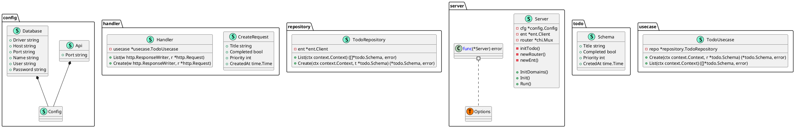

```plantuml
@startuml
namespace config {
    class Api << (S,Aquamarine) >> {
        + Port string

    }
    class Config << (S,Aquamarine) >> {
    }
    class Database << (S,Aquamarine) >> {
        + Driver string
        + Host string
        + Port string
        + Name string
        + User string
        + Password string

    }
}
"config.Api" *-- "config.Config"
"config.Database" *-- "config.Config"


namespace handler {
    class CreateRequest << (S,Aquamarine) >> {
        + Title string
        + Completed bool
        + Priority int
        + CreatedAt time.Time

    }
    class Handler << (S,Aquamarine) >> {
        - usecase *usecase.TodoUsecase

        + List(w http.ResponseWriter, r *http.Request) 
        + Create(w http.ResponseWriter, r *http.Request) 

    }
}


namespace repository {
    class TodoRepository << (S,Aquamarine) >> {
        - ent *ent.Client

        + List(ctx context.Context) ([]*todo.Schema, error)
        + Create(ctx context.Context, t *todo.Schema) (*todo.Schema, error)

    }
}


namespace server {
    class Server << (S,Aquamarine) >> {
        - cfg *config.Config
        - ent *ent.Client
        - router *chi.Mux

        - initTodo() 
        - newRouter() 
        - newEnt() 

        + InitDomains() 
        + Init() 
        + Run() 

    }
    class server.Options << (T, #FF7700) >>  {
    }
}


namespace todo {
    class Schema << (S,Aquamarine) >> {
        + Title string
        + Completed bool
        + Priority int
        + CretedAt time.Time

    }
}


namespace usecase {
    class TodoUsecase << (S,Aquamarine) >> {
        - repo *repository.TodoRepository

        + Create(ctx context.Context, r *todo.Schema) (*todo.Schema, error)
        + List(ctx context.Context) ([]*todo.Schema, error)

    }
}


"server.<font color=blue>func</font>(*Server) error" #.. "server.Options"
@enduml
```
